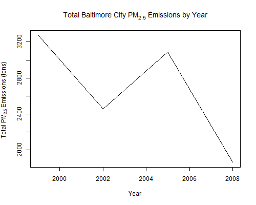

Exploratory Data Analysis Project
========================================================

# Assignment 2

Introduction
-------------

Fine particulate matter ($PM_{2.5}$) is an ambient air pollutant for which there is strong evidence that it is harmful to human health. In the United States, the Environmental Protection Agency (EPA) is tasked with setting national ambient air quality standards for fine PM and for tracking the emissions of this pollutant into the atmosphere. Approximatly every 3 years, the EPA releases its database on emissions of $PM_{2.5}$. This database is known as the National Emissions Inventory (NEI). You can read more information about the NEI at the [EPA National Emissions Inventory web site] (http://www.epa.gov/ttn/chief/eiinformation.html).

For each year and for each type of PM source, the NEI records how many tons of $PM_{2.5}$ were emitted from that source over the course of the entire year. The data that you will use for this assignment are for 1999, 2002, 2005, and 2008.

Data
---------

The data for this assignment are available from the course web site as a single zip file:

* [Data for Peer Assessment] (https://d396qusza40orc.cloudfront.net/exdata%2Fdata%2FNEI_data.zip) [29Mb]

The zip file contains two files:

$PM_{2.5}$ Emissions Data (``summarySCC_PM25.rds``): This file contains a data frame with all of the PM2.5 emissions data for 1999, 2002, 2005, and 2008. For each year, the table contains number of **tons** of $PM_{2.5}$ emitted from a specific type of source for the entire year. Here are the first few rows.


```
##     fips      SCC Pollutant Emissions  type year
## 4  09001 10100401  PM25-PRI    15.714 POINT 1999
## 8  09001 10100404  PM25-PRI   234.178 POINT 1999
## 12 09001 10100501  PM25-PRI     0.128 POINT 1999
## 16 09001 10200401  PM25-PRI     2.036 POINT 1999
## 20 09001 10200504  PM25-PRI     0.388 POINT 1999
## 24 09001 10200602  PM25-PRI     1.490 POINT 1999
```


* ``fips``: A five-digit number (represented as a string) indicating the U.S. county
* ``SCC``: The name of the source as indicated by a digit string (see source code classification table)
* ``Pollutant``: A string indicating the pollutant
* ``Emissions``: Amount of PM2.5 emitted, in tons
* ``type``: The type of source (point, non-point, on-road, or non-road)
* ``year``: The year of emissions recorded

Source Classification Code Table (``Source_Classification_Code.rds``): This table provides a mapping from the SCC digit strings int he Emissions table to the actual name of the $PM_{2.5}$ source. The sources are categorized in a few different ways from more general to more specific and you may choose to explore whatever categories you think are most useful. For example, source “10100101” is known as “Ext Comb /Electric Gen /Anthracite Coal /Pulverized Coal”.

You can read each of the two files using the ``readRDS()`` function in R. For example, reading in each file can be done with the following code:


```r
## This first line will likely take a few seconds. Be patient!
NEI <- readRDS("summarySCC_PM25.rds")
SCC <- readRDS("Source_Classification_Code.rds")
```


as long as each of those files is in your current working directory (check by calling ``dir()`` and see if those files are in the listing).

Assignment
---------------

The overall goal of this assignment is to explore the National Emissions Inventory database and see what it say about fine particulate matter pollution in the United states over the 10-year period 1999–2008. You may use any R package you want to support your analysis.

### Questions

You must address the following questions and tasks in your exploratory analysis. For each question/task you will need to make a single plot. Unless specified, you can use any plotting system in R to make your plot.

1. Have total emissions from $PM_{2.5}$ decreased in the United States from 1999 to 2008? Using the **base** plotting system, make a plot showing the total $PM_{2.5}$ emission from all sources for each of the years 1999, 2002, 2005, and 2008.
2. Have total emissions from $PM_{2.5}$ decreased in the **Baltimore City**, Maryland (``fips == "24510"``) from 1999 to 2008? Use the base plotting system to make a plot answering this question.
3. Of the four types of sources indicated by the ``type`` (point, nonpoint, onroad, nonroad) variable, which of these four sources have seen decreases in emissions from 1999–2008 for **Baltimore City**? Which have seen increases in emissions from 1999–2008? Use the **ggplot2** plotting system to make a plot answer this question.
4. Across the United States, how have emissions from coal combustion-related sources changed from 1999–2008?
5. How have emissions from motor vehicle sources changed from 1999–2008 in **Baltimore City**?
6. Compare emissions from motor vehicle sources in Baltimore City with emissions from motor vehicle sources in **Los Angeles County**, California (``fips == "06037"``). Which city has seen greater changes over time in motor vehicle emissions?

### Making and Submitting Plots

For each plot you should

* Construct the plot and save it to a **PNG file**.
* Create a separate R code file (``plot1.R``, ``plot2.R``, etc.) that constructs the corresponding plot, i.e. code in plot1.R constructs the plot1.png plot. Your code file should include code for reading the data so that the plot can be fully reproduced. You should also include the code that creates the PNG file. Only include the code for a single plot (i.e. ``plot1.R`` should only include code for producing ``plot1.png``)
* Upload the PNG file on the Assignment submission page
* Copy and paste the R code from the corresponding R file into the text box at the appropriate point in the peer assessment.

# Exploratory Data Analysis Project 2 (JHU) Coursera

Downloading the data set
----------
```R

# init variables about subdirectory, zipfilename and zipfilepath
subdirectory              <- "./data/"
zipFileName               <- "NEI_data.zip"
zipFilePath               <- paste0(subdirectory, zipFileName)
fileURL                   <- "https://d396qusza40orc.cloudfront.net/exdata%2Fdata%2FNEI_data.zip"

# If subdirectory "data" doesn't exists, then create this.
if (!file.exists("data")) {
  dir.create("data")
}

# If zip file isn't stored in subdirectory data, it will be downloaded.
if (!file.exists(zipFilePath)){
  download.file(fileURL, zipFilePath, method="curl")
}  

# Upzip downloaded zip file
if (file.exists(zipFilePath)) { 
  unzip(zipFilePath, exdir = subdirectory) 
}

```


Loading Files (common to all plots)
----------
```R
SCCFile <- "./data/Source_Classification_Code.rds"
summarySCC_PM25File <- "./data/summarySCC_PM25.rds"

# Read files
NEI <- readRDS(summarySCC_PM25File)
SCC <- readRDS(SCCFile)
```


Question 1 ([plot1.R](plot1.R))
----------
Have total emissions from PM2.5 decreased in the United States from 1999 to 2008? 
Using the base plotting system, make a plot showing the total PM2.5 emission from all sources for each of the years 1999, 2002, 2005, and 2008.

```R
totalPM25ByYear <- tapply(NEI$Emissions, NEI$year, sum)

# Plot the result
plot(names(totalPM25ByYear), totalPM25ByYear, type = "l",
     xlab = "Year", ylab = expression("Total" ~ PM[2.5] ~ "Emissions (tons)"),
     main = expression("Total US" ~ PM[2.5] ~ "Emissions by Year"))
```

 

### We can conclude that the emission form PM2.5 have decreased from 1999 to 2008

Question 2 ([plot2.R](plot2.R))
----------
Have total emissions from PM2.5 decreased in the Baltimore City, Maryland (𝚏𝚒𝚙𝚜 == "𝟸𝟺𝟻𝟷𝟶") from 1999 to 2008? Use the base plotting system to make a plot answering this question.

```R
# filter data
BaltimoreCity <- NEI %>% filter(fips == 24510)

# Calculate the sum of emission by year
totalPM25ofBCByYear <- tapply(BaltimoreCity$Emissions, BaltimoreCity$year, sum)


plot(names(totalPM25ofBCByYear), totalPM25ofBCByYear, type = "l", xlab = "Year", 
     ylab = expression("Total" ~ PM[2.5] ~ "Emissions (tons)"), 
     main = expression("Total Baltimore City" ~ PM[2.5] ~ "Emissions by Year"))

```
 
### Yes the total emissions have decreased
Question 3 ([plot3.R](plot3.R))
----------
Of the four types of sources indicated by the 𝚝𝚢𝚙𝚎 (point, nonpoint, onroad, nonroad) variable, which of these four sources have seen decreases in emissions from 1999–2008 for Baltimore City? 
Which have seen increases in emissions from 1999–2008? Use the ggplot2 plotting system to make a plot answer this question.

```R
# filter data
BaltimoreCity <- NEI %>% filter(fips == 24510)
colnames(BaltimoreCity)


png("plot3.png")
ggplot(BaltimoreCity,aes(factor(year),Emissions,fill=type)) +
  geom_bar(stat="identity") +
  theme_bw() + guides(fill=FALSE)+
  facet_grid(.~type,scales = "free",space="free") + 
  labs(x="year", y=expression("Total PM"[2.5]*" Emission (Tons)")) + 
  labs(title=expression("PM"[2.5]*" Emissions, Baltimore City 1999-2008 by Source Type"))
```

 
### Emission Type - Non Road, Non Point and On Road have seen decrease <br> Emission Type - point has seen Increase Followed by a Decrease

Question 4 ([plot4.R](plot4.R))
----------
Across the United States, how have emissions from coal combustion-related sources changed from 1999–2008?

```R
# Fetch coal-combustion only
CoalCombustionSCC0 <- subset(SCC, EI.Sector %in% c("Fuel Comb - Comm/Instutional - Coal",
                                                   "Fuel Comb - Electric Generation - Coal",
                                                   "Fuel Comb - Industrial Boilers, ICEs - Coal"))

# Compare to Short.Name matching both Comb and Coal
CoalCombustionSCC1 <- subset(SCC, grepl("Comb", Short.Name) & 
                               grepl("Coal", Short.Name))

# 
print(paste("Number of subsetted lines via EI.Sector:", nrow(CoalCombustionSCC0)))
print(paste("Number of subsetted lines via Short.Name:", nrow(CoalCombustionSCC1)))

# set the differences
diff0 <- setdiff(CoalCombustionSCC0$SCC, CoalCombustionSCC1$SCC)
diff1 <- setdiff(CoalCombustionSCC1$SCC, CoalCombustionSCC0$SCC)

print(paste("Number of setdiff (data via EI.Sector & Short.Name):", length(diff0)))
print(paste("Number of setdiff (data via Short.Name & EI.Sector):", length(diff1)))

# Create the union of SCCs via EI.Sector & Short.Name
CoalCombustionSCCCodes <- union(CoalCombustionSCC0$SCC, CoalCombustionSCC1$SCC)
print(paste("Number of SCCs:", length(CoalCombustionSCCCodes)))

# Fetch needed NEI data via SCCs
CoalCombustion <- subset(NEI, SCC %in% CoalCombustionSCCCodes)

# Calculate the sum of emission by type and year
coalCombustionPM25ByYear <- CoalCombustion %>% select(year, type, Emissions) %>%
  group_by(year, type) %>%
  summarise_each(funs(sum))

# Plot the result

ggplot(coalCombustionPM25ByYear, aes(x = year, y = Emissions, color = type)) +
  geom_line() +
  stat_summary(fun = sum, aes(group = 1), geom = "line", color = "purple") +
  ggtitle(expression("Coal Combustion" ~ PM[2.5] ~ "Emissions by Source Type and Year")) + 
  xlab("Year") + 
  ylab(expression("Total" ~ PM[2.5] ~ "Emissions (tons)"))
```

 

Question 5 ([plot5.R](plot5.R))
----------
How have emissions from motor vehicle sources changed from 1999–2008 in Baltimore City?

```R
# Gather the subset of the NEI data which corresponds to vehicles
BaltimoreCity <- NEI %>%
  filter(fips == "24510" , type=="ON-ROAD")%>%
  select (year, Emissions) %>% 
  group_by(year) %>% summarise(sum = sum(Emissions)) 
BaltimoreCity


ggplot(BaltimoreCity, aes(x = year, y = sum)) +
  geom_line() +
  ggtitle(expression("Baltimore City" ~ PM[2.5] ~ "Motor Vehicle Emissions by Year")) +
  xlab("Year") + 
  ylab(expression("Total" ~ PM[2.5] ~ "Emissions (tons)"))
```
### Yes it has decreased
 

Question 6 ([plot6.R](plot6.R))
----------
Compare emissions from motor vehicle sources in Baltimore City with emissions from motor vehicle sources in Los Angeles County, California (𝚏𝚒𝚙𝚜 == "𝟶𝟼𝟶𝟹𝟽"). Which city has seen greater changes over time in motor vehicle emissions?

```R
# Fetch data of type "ON-ROAD" from Baltimore City & Los Angeles County, California
MV <- subset(NEI, (fips == "24510" | fips == "06037") & type=="ON-ROAD")
# Use more meaningful variable names
MV <- transform(MV, region = ifelse(fips == "24510", "Baltimore City", 
                                    "Los Angeles County"))

# Calculate the sum of emission by year and region
MVPM25ByYearAndRegion <- MV %>% select (year, region, Emissions) %>% 
  group_by(year, region) %>% 
  summarise_each(funs(sum))

# Create a plot normalized to 1999 levels to better show change over time
Balt1999Emissions <- subset(MVPM25ByYearAndRegion, year == 1999 & 
                              region == "Baltimore City")$Emissions
LAC1999Emissions <- subset(MVPM25ByYearAndRegion, year == 1999 & 
                             region == "Los Angeles County")$Emissions
MVPM25ByYearAndRegionNorm <- transform(MVPM25ByYearAndRegion,
                                       EmissionsNorm = ifelse(region == 
                                                                "Baltimore City",
                                                              Emissions / Balt1999Emissions,
                                                              Emissions / LAC1999Emissions))

# Plot the result
ggplot(MVPM25ByYearAndRegionNorm, aes(x = year, y = EmissionsNorm, color = region)) +
  geom_line() +
  ggtitle(expression("Total" ~ PM[2.5] ~ "Motor Vehicle Emissions Normalized to 1999 Levels")) + 
  xlab("Year") +
  ylab(expression("Normalized" ~ PM[2.5] ~ "Emissions"))

```

 

### Baltimore has seen greater changes over time 
